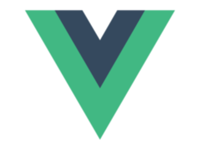

# Lab 4.2

[Lab 4.2](https://canvas.kth.se/courses/36975/assignments/241595/) [_(demo)_](https://lab4.intnetxx.org/) ska lämnas in i [client](./client/) och [server](./server/) före presentationen. Båda studenterna ska kunna redogöra för programmets alla delar. [Lab 4X](https://canvas.kth.se/courses/36975/assignments/241595/) ska lämnas in i [bonus](./bonus/) **senast den 6:e april** för att få bonuspoäng. Följ instruktionerna nedan och se till att ha en övergripande förståelse för hur alla filer hänger ihop innan programmet vidareutvecklas. Mer information om hur filerna är strukturerade finns på Canvas. _Lycka till!_

## Introduktion

**Viktiga länkar:**

- [Vue.js](https://vuejs.org/) _(endast på klientsidan)_
- [Vue Router](https://router.vuejs.org/) _(endast på klientsidan)_
- [Vuex](https://vuex.vuejs.org/) _(endast på klientsidan)_
- [Express.js](https://expressjs.com/) _(endast på serversidan)_
- [Socket.IO](https://socket.io/) _(både på klient- och serversidan)_

**Ytterligare länkar som kan vara av intresse:**

- [Vue Devtools](https://devtools.vuejs.org/) _(endast på klientsidan)_
- [Vite.js](https://vitejs.dev/) _(endast på klientsidan)_
- [Bootstrap](https://getbootstrap.com/) _(endast på klientsidan)_
- [m.m.](https://www.npmjs.com/)

1. Klona ned och navigera till repot i terminalen.
2. Kör `npm install` för att installera alla nödvändiga paket.[1](#1)
3. Kör `npm start` för att starta servern.[2](#2)
4. Öppna webbläsaren och navigera till [localhost:8989](http://localhost:8989/).

[1](#1) Alla paket ska alltid installeras där de används, antingen i [client](./client/) eller [server](./server/). **Kommandot `npm install <package-name>` ska aldrig köras utanför dessa mappar.**
 
[2](#2) Vid detta tillfälle är Vue-applikationen klar att serveras.

## Statisk kodanalys _(lint)_

Statisk kodanalys utförs för att hitta potentiella fel, misstänkta konstruktioner eller andra problem relaterade till bristande kodkvalitet. Följande steg är nödvändiga för att utföra statisk kodanalys och därmed bli godkänd på uppgiften. Observera att **alla rapporterade problem ska åtgärdas** före presentationen. Vidare måste den senaste versionen av [Node.js LTS](https://nodejs.org/) installeras innan instruktionerna nedan kan utföras.

1. Klona ned och navigera till repot i terminalen.
2. Kör `npm install` för att installera alla nödvändiga paket.
3. Kör `npm run lint` för att analysera koden och se resultatet.

Observera att de allra flesta problem kan elimineras _automatiskt_ genom att köra `npm run lint:fix`. Se därför till att _kontinuerligt_ köra kommandot ovan och åtgärda nya problem på löpande basis.
